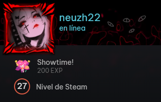
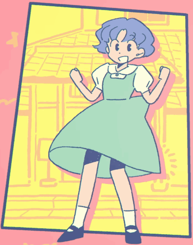

<br/>

```
neuzh22@github
-------------------------
👩‍💻 **Software Development Technologist** at **Tecnológico Argos**
🌱 Currently working on **Compiler optimization**
🧰 Languages: **Python, JavaScript, C/C++, PowerShell, CSS, HTML, Dockerfile**
📝 Keen on crafting neat, beautiful LaTeX HW
🕹 Love video games & anime — favorites: **Black Clover** 🗡️ and **Ranma ½** ☯
🎧 On repeat: **LiSA & Ado** ♫ the queens of anisong ✨
```

<br clear="left"/>

---



### 🎮 Steam — Juegos favoritos

| Juego | ⏱️ Horas |
|-------|---------|
| 🎯 Strinova | 54.3h |
| 🔫 Call of Duty® | 46.4h |
| 💥 FragPunk | 32.7h |
| 🐴 Umamusume: Pretty Derby | 30.7h |
| 🎵 Hatsune Miku: Project DIVA Mega Mix+ | 28.9h |

**Total: 228 juegos** · **10 completados al 100%** · **21 seguidos**

🔄 Actualizado: 10/08/2026 00:00

[](https://steamcommunity.com/profiles/76561199132635436)

<br clear="right"/>

---

<table><tr><td>

</td><td style="padding-left: 30px;">
<h3>🎧 音楽</h3>
<a href="https://open.spotify.com/user/317zqnqhbclp6wzzokz6xp6igbdi">

</a>
</td></tr></table>

---

<div align="center">✨ 魔法帝 ✨</div>
