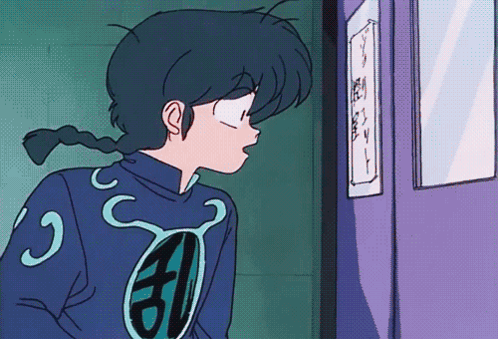
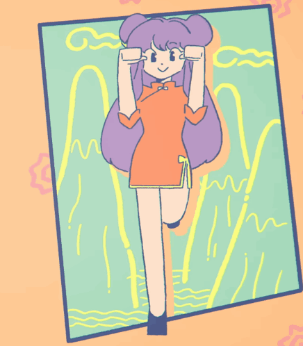

<div align="center">

</div>

<div align="center">


```
neuzh22@github
-------------------------
- 👩‍💻 **Software Development Technologist** at **Tecnológico Argos**
- 🌱 Currently working on **Compiler optimization**
- 🧰 Languages: **Python, JavaScript, C/C++, PowerShell, CSS, HTML, Dockerfile**
- 📝 Keen on crafting neat, beautiful LaTeX HW
- 🏃 Marathon / hiking / cycling
- 🕹 Love video games & anime — favorites: **Black Clover** 🗡️ and **Ranma ½** ☯
- 🎧 On repeat: **LiSA & Ado** ♫ the queens of anisong ✨
```

<br clear="left"/>
</div>

<div align="center">

</div>

<div align="center">

### 🎮 Steam

[](https://steamcommunity.com/profiles/76561199132635436)

</div>

<div align="center">

</div>

<div align="center">

### 🎧 Spotify

</div>

<div align="center">
<iframe style="border-radius:14px" src="https://open.spotify.com/embed/playlist/1igNed0LVe6aMcGKyNgVlf?utm_source=generator&theme=0" width="100%" height="380" frameBorder="0" allowfullscreen="" allow="autoplay; clipboard-write; encrypted-media; fullscreen; picture-in-picture" loading="lazy"></iframe>
</div>

<div align="center">

</div>

<div align="center">

### 📈 GitHub Stats

</div>

<div align="center">

<br/>

</div>

<div align="center">

</div>

<div align="center">

### 🔗 Contact

[](https://discord.com)
[](https://steamcommunity.com/profiles/76561199132635436)
[](https://open.spotify.com/playlist/1igNed0LVe6aMcGKyNgVlf)

</div>

<div align="center">

<br/>
✨ 魔法帝 ✨
</div>
